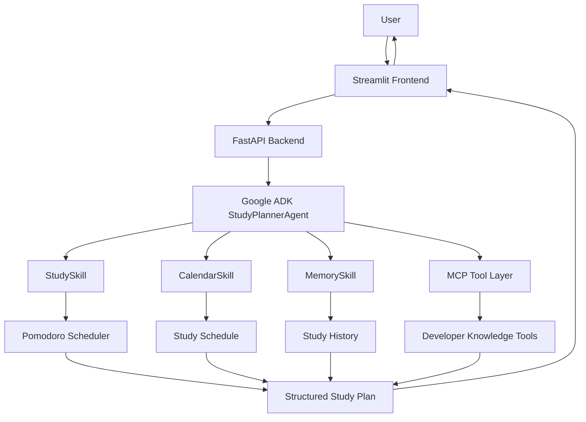

# Smart Study Planner Agent Architecture

```mermaid
flowchart TD

    U[User]

    U --> S[Streamlit Frontend]

    S --> F[FastAPI Backend]

    F --> A[Google ADK StudyPlannerAgent]

    A --> SS[StudySkill]

    A --> CS[CalendarSkill]

    A --> MS[MemorySkill]

    A --> MCP[MCP Tool Layer]

    SS --> P[Pomodoro Scheduler]

    CS --> SCH[Study Schedule]

    MS --> MEM[Study History]

    MCP --> TOOLS[Developer Knowledge Tools]

    P --> R[Structured Study Plan]

    SCH --> R

    MEM --> R

    TOOLS --> R

    R --> S

    S --> U
```